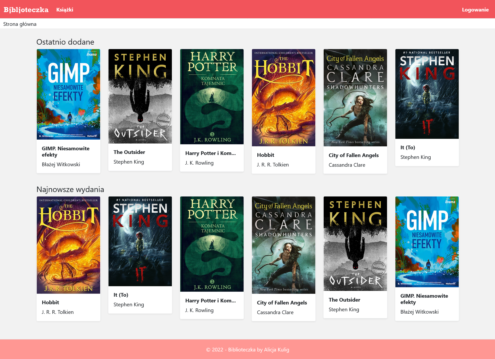
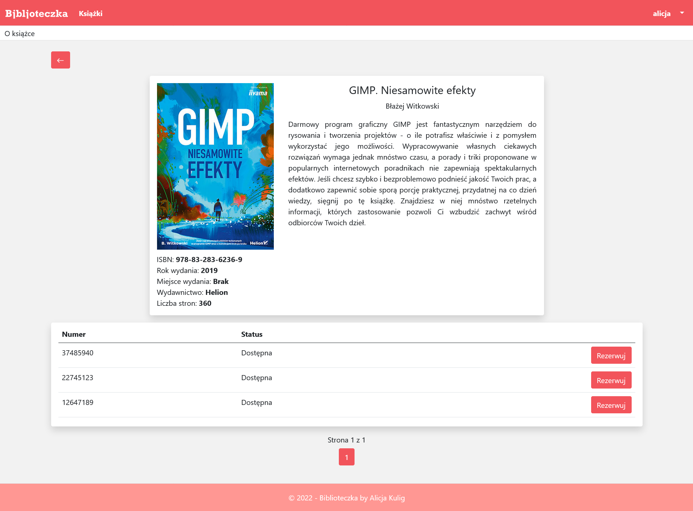
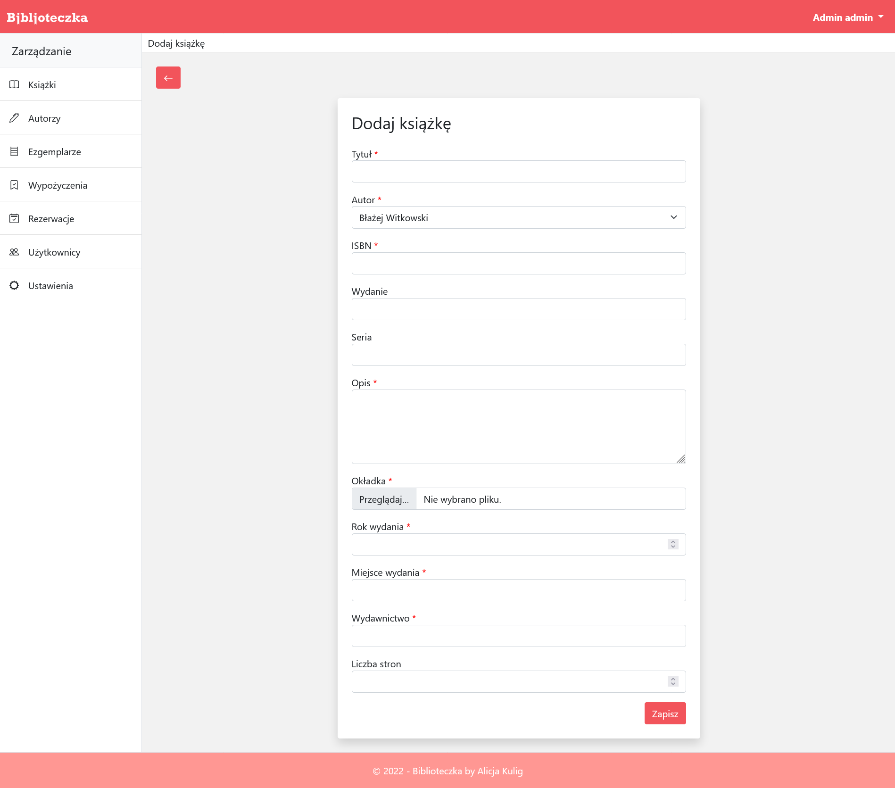

# Biblioteczka
Biblioteczka is a web app written with ASP.NET Core. It was created to manage books in the library. The user of the application can reserve a copy of the book he is interested in and browse the list of borrowed books.


## Table of contents
* [Technology](#technology)
* [Installation](#installation)
* [Admin Account](#admin)
* [Features](#features)
* [Screenshots](#screenshots)


## Technology
Project is created with:
* ASP.NET Core 6
* C#
* SQL Server
* JavaScript
* Bootstrap 5

## Installation

1. Clone the repository
	```
	git clone https://github.com/Alakul/Biblioteczka.git
	```

2. Open project with Visual Studio 2022

3. Run migrations
	```
	Update-Database
	```

<a name="admin"/>	
## Admin Account
<p>Email: admin@gmail.com</p>
<p>Password: 12345678</p>

	
## Features
List of features
* Authentication
* Managing of book, authors, copies
* Browsing for books
* Making reservation
* Borrowing a book
* Changing profile settings


## Screenshots
<p>
    
    <em>Home page</em>
</p>
</br>
<p>
    
    <em>Book details</em>
</p>
</br>
<p>
    
    <em>Book adding form</em>
</p>